# Laporan Proyek Machine Learning
### Nama : Astrid Putri Salsabiela
### NIM : 211351032
### Kelas : Malam A

### Domain Proyek:
Proyek Breast Cancer Wisconsin (UCI ML Repository) berada dalam domain kesehatan dan ilmu kedokteran, khususnya dalam deteksi dini kanker payudara.

### Business Understanding:
Untuk mendeteksi kanker payudara secara dini memiliki dampak besar pada peluang kesembuhan. Proyek ini bertujuan untuk menyediakan alat yang dapat membantu dokter dalam mendiagnosis potensi keganasan tumor.

### Problem Statement:
Bagaimana mengembangkan model klasifikasi menggunakan metode K-Nearest Neighbors (KNN) untuk memprediksi keganasan tumor pada sel-sel payudara berdasarkan fitur medis tertentu.

### Goals:
- Mendeteksi keganasan tumor pada sel payudara.
- Meningkatkan diagnosis dini kanker payudara.
- Memberikan dukungan keputusan klinis yang cepat dan akurat.

### Solution Statements:
Solusi proyek ini adalah membangun model Machine Learning yang akan menggunakan metode KNN untuk mengembangkan model klasifikasi yang dapat memprediksi keganasan tumor berdasarkan pola kedekatan data.

### Data Understanding:
- Dataset: Breast Cancer Wisconsin (UCI ML Repository) [kaggle](https://www.kaggle.com/datasets/uciml/breast-cancer-wisconsin-data?resource=download)
- Jumlah Baris: Varied
- Jumlah Kolom: 30
- Tipe Data: Numerik

### Variabel yang Digunakan:
- *Fitur yang digunakan (Features):*
  - Radius Mean : (Visual Characteristics of cancer)
  - Texture Mean : (Visual Characteristics of cancer)
  - Perimeter Mean : (Visual Characteristics of cancer)
  - Area Mean : (Visual Characteristics of cancer)
  - Smoothness Mean : (Visual Characteristics of cancer)
  - Compactness Mean : (Visual Characteristics of cancer)
  - Concavity Mean : (Visual Characteristics of cancer)
  - Concave Points Mean : (Visual Characteristics of cancer)
  - Symmetry Mean : (Visual Characteristics of cancer)
  - Fractal Dimension Mean : (Visual Characteristics of cancer)

- *Target Variable:*
  - Diagnosis : Cancer Types (Benign cancer (B) or Malignant cancer (M))

## Data Preparation
### Data Collection:
Menggunakan dataset Breast Cancer Wisconsin dari [kaggle](https://www.kaggle.com/datasets/uciml/breast-cancer-wisconsin-data?resource=download).

### Import Dataset:
Ambil dataset dari Kaggle (pastikan Anda sudah mengatur API Kaggle Anda).
Ganti username dan key dengan informasi API Kaggle Anda
Kaggle API dapat diatur di halaman profil [kaggle](https://www.kaggle.com/account) anda.

Setelah mengunduh file kaggle.json dari halaman profil Kaggle, upload file tersebut ke penyimpanan tempat Anda menjalankan kode ini.
```
from google.colab import files
files.upload()
```

Pindahkan file kaggle.json ke direktori yang benar
```
!mkdir -p ~/.kaggle
!cp kaggle.json ~/.kaggle/
!chmod 600 ~/.kaggle/kaggle.json
!ls ~/.kaggle
```

Unduh dataset dari Kaggle
```
!kaggle datasets download -d uciml/breast-cancer-wisconsin-data
```

Ekstrak file zip
```
!unzip breast-cancer-wisconsin-data.zip -d breast-cancer-wisconsin-data
!ls breast-cancer-wisconsin-data
```

### Import Library
Import semua library yang dibutuhkan,
```
import pandas as pd
import numpy as np
import matplotlib.pyplot as plt
import sklearn.metrics as metrics
import seaborn as sns

from sklearn.model_selection import train_test_split
from sklearn.preprocessing import StandardScaler,LabelEncoder
from sklearn import preprocessing 
from sklearn.linear_model import LogisticRegression
from sklearn.metrics import accuracy_score,classification_report
from sklearn.metrics import confusion_matrix,ConfusionMatrixDisplay
from sklearn.neighbors import KNeighborsClassifier

import pickle
import warnings
warnings.filterwarnings("ignore")
```
### Data Discovery
load data, baca dataset ke dalam DataFrame Pandas
```
df = pd.read_csv('breast-cancer-wisconsin-data/data.csv')
```

lakukan pemeriksaan awal data, termasuk melihat struktur data, tipe data kolom, dan beberapa baris pertama data
```
df.head()
df.describe()
df.info()
```

jika ada kolom yang tidak relevan untuk analisis atau prediksi, anda bisa menghapusnya
```
columns_to_drop = ['id', 'radius_se', 'texture_se', 'perimeter_se', 'area_se', 'smoothness_se', 'compactness_se', 'concavity_se', 'concave points_se', 'symmetry_se', 'fractal_dimension_se', 'radius_worst', 'texture_worst', 'perimeter_worst', 'area_worst', 'smoothness_worst', 'compactness_worst', 'concavity_worst', 'concave points_worst', 'symmetry_worst', 'fractal_dimension_worst', 'Unnamed: 32']
df.drop(columns=columns_to_drop, inplace=True)
```

selanjutnya kita akan memeriksa apakah datasetsnya terdapat baris yang kosong atau null
```
df.isnull().sum()
```

### EDA
Persebaran Diagnosis
```
sns.countplot(x='diagnosis', data=df)
plt.title('Persebaran Diagnosis')
plt.show()
```
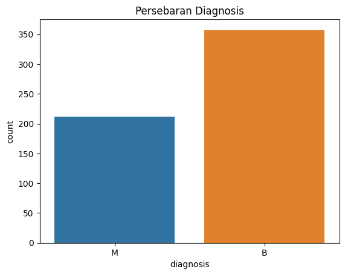

Pairplot untuk Fitur Utama
```
sns.pairplot(df[['radius_mean', 'texture_mean', 'perimeter_mean', 'area_mean', 'smoothness_mean', 'compactness_mean', 'concavity_mean', 'concave points_mean', 'symmetry_mean', 'fractal_dimension_mean']])
plt.show()
```
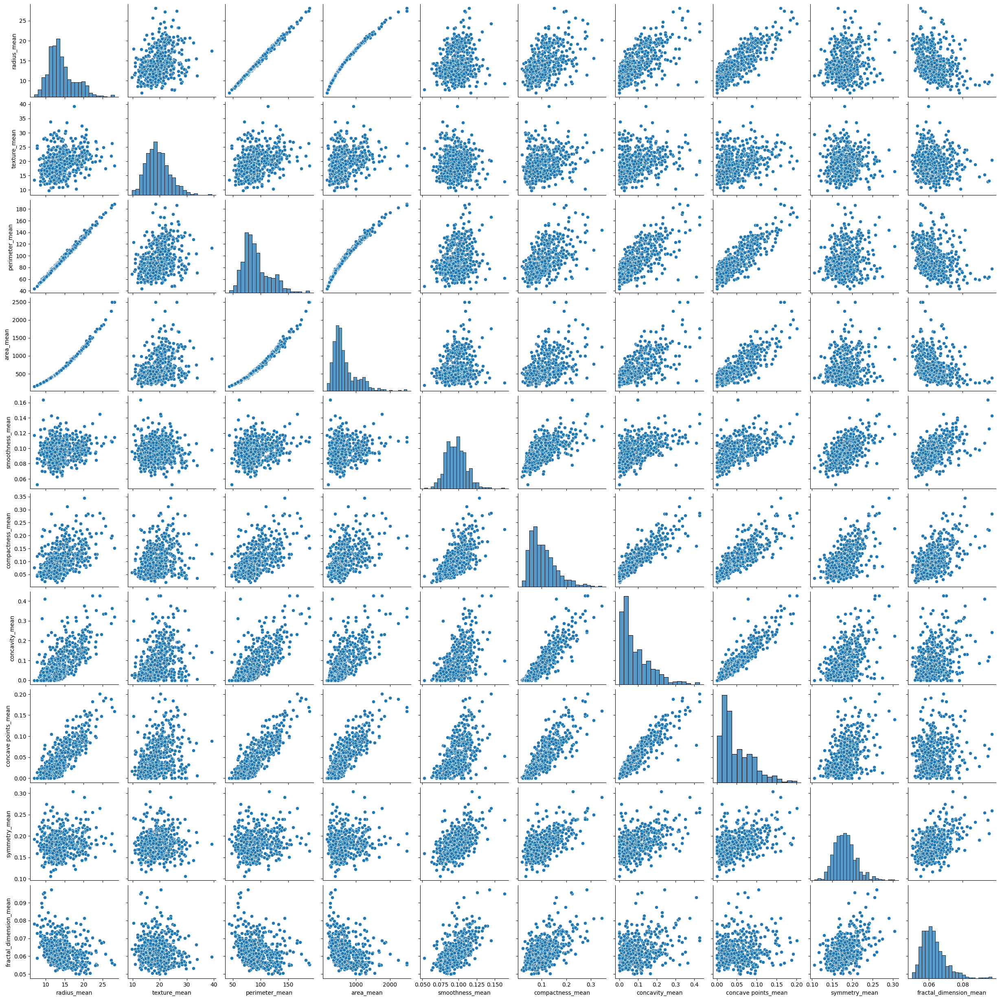

Korelasi heatmap
```
plt.figure(figsize=(20, 14))
sns.heatmap(correlation_matrix, annot=True, cmap='coolwarm', fmt=".2f", linewidths=0.5)
plt.title('Correlation Heatmap')
plt.show()
```
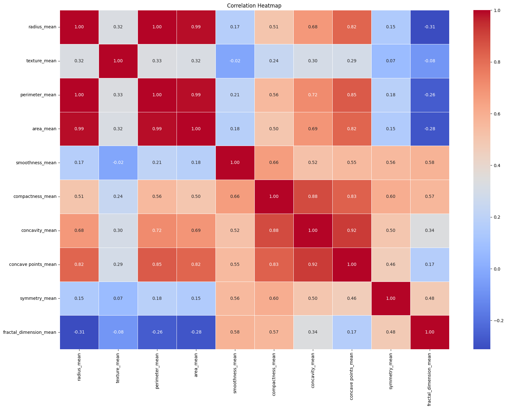

Boxplot untuk fitur penting
```
plt.figure(figsize=(15, 10))
sns.boxplot(x='diagnosis', y='radius_mean', data=df)
plt.title('Boxplot: Diagnosis vs Radius Mean')
plt.show()
```
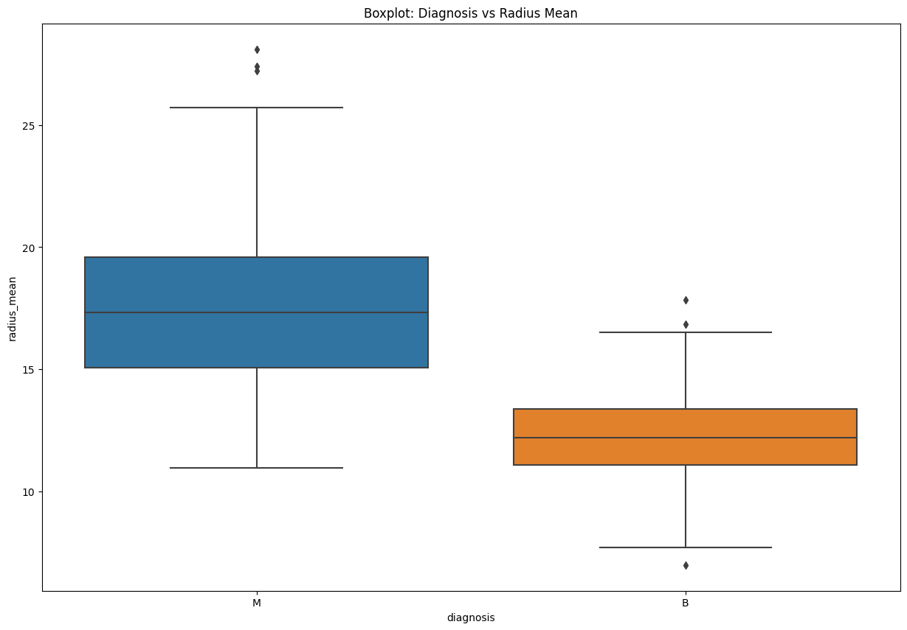

Violinplot untuk fitur signifikan
```
plt.figure(figsize=(15, 10))
sns.violinplot(x='diagnosis', y='area_mean', data=df)
plt.title('Violinplot: Diagnosis vs Area Mean')
plt.show()
```
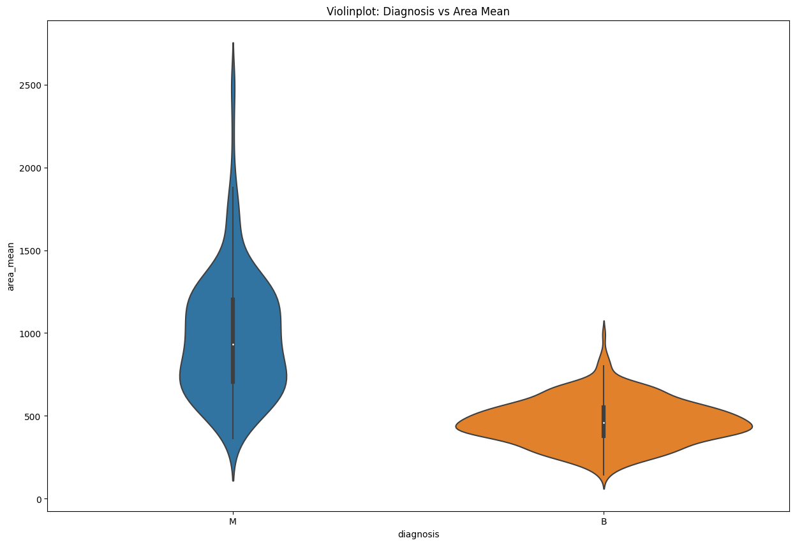

KDE Plot untuk perbandingan fitur
```
sns.kdeplot(data=df, x='radius_mean', hue='diagnosis', fill=True, common_norm=False)
plt.title('KDE Plot: Radius Mean berdasarkan Diagnosis')
plt.show()
```
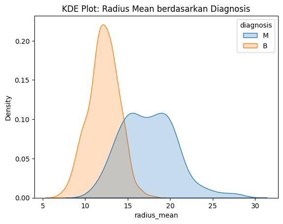

Perbandingan Diagnosis dengan fitur korelasi tinggi
```
sns.lmplot(x='radius_mean', y='texture_mean', hue='diagnosis', data=df)
plt.title('Perbandingan Diagnosis dengan Radius Mean dan Texture Mean')
plt.show()
```
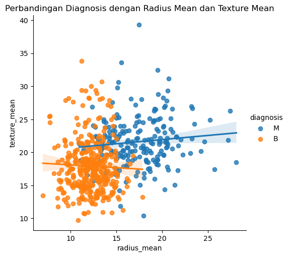

### Prepocessing:
Konversi Label kategori ke numerik
```
label_encoder = preprocessing.LabelEncoder() 
df['diagnosis']=label_encoder.fit_transform(df['diagnosis'])
```

Memilih atribut yang akan digunakan untuk prediksi
```
features = ['radius_mean', 'texture_mean', 'perimeter_mean', 'area_mean', 'smoothness_mean', 'compactness_mean', 'concavity_mean', 'concave points_mean', 'symmetry_mean', 'fractal_dimension_mean']
x = df[features]
y = df['diagnosis']
x.shape, y.shape
```

Pisahkan fitur dan label
```
X = df.drop('diagnosis',axis='columns')
y = df['diagnosis']
```

Normalisasi fitur
```
StandardScalerModel= StandardScaler()
x = StandardScalerModel.fit_transform(X)
```

Pisahkan data menjadi data latih dan data uji
```
x_train,x_test,y_train,y_test=train_test_split(X,y,test_size=0.3,random_state=101)
```

### Data Modeling:
```
knn = KNeighborsClassifier(n_neighbors=10,)
knn.fit(x_train,y_train)
```

```
y_pred = knn.predict(x_test)
```

```
conf_matrix = confusion_matrix(y_test,y_pred)
```

```
model1=KNeighborsClassifier(n_neighbors=3)
model1.fit(x_train,y_train)
y_pred1=model1.predict(x_test)
```

```
score = model1.score(x_test, y_test)
print('akurasi model knn = ', score)
```
akurasi model knn =  0.8654970760233918

```
plt.figure(figsize=(10,6))
plt.plot(range(1,50),error_rate,color='blue', linestyle='dashed', marker='o', markerfacecolor='red', markersize=10)
plt.title('Error Rate vs. K Value')
plt.xlabel('K')
plt.ylabel('Error Rate')
```
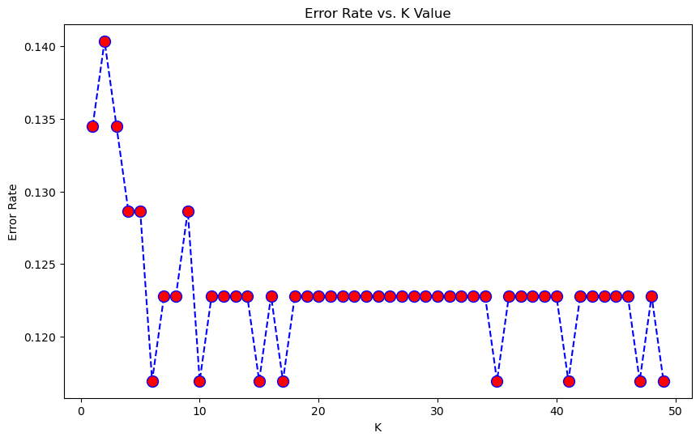

Confusion matrix without normalization
```
print('Confusion matrix without normalization')
ConfusionMatrixDisplay.from_estimator(

    knn,
    x_test,
    y_test,
    cmap='Blues'

)
plt.show()
```
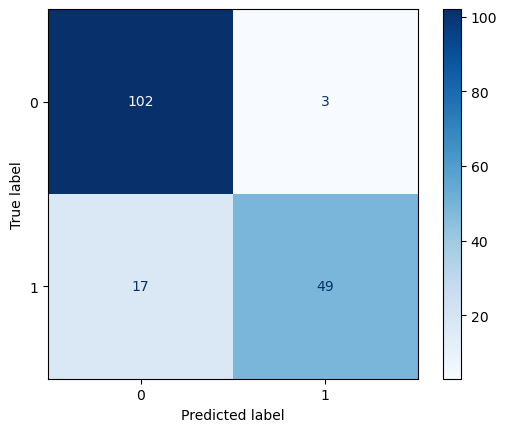

Confusion matrix with normalization
```
print('Normalized confusion matrix')
ConfusionMatrixDisplay.from_estimator(

    knn,
    x_test,
    y_test,
    normalize='true',
    cmap='Blues'

)
plt.show()
```
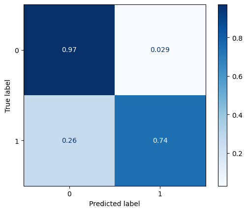

### Evaluation:
Secara singkat, inilah penjelasan singkat untuk metrik-metrik evaluasi dalam KNN:
```
knn = KNeighborsClassifier(n_neighbors=5)
knn.fit(x_train,y_train)
pred = knn.predict(x_test)
pred1 = knn.predict(x_train)
print('Testing')
print(confusion_matrix(y_test,pred))
print(classification_report(y_test,pred))
print('training')
print(confusion_matrix(y_train,pred1))
print(classification_report(y_train,pred1))
```

Testing
[98  7]
 [15 51]
              precision    recall  f1-score   support

           0       0.87      0.93      0.90       105
           1       0.88      0.77      0.82        66

    accuracy                           0.87       171
   macro avg       0.87      0.85      0.86       171
weighted avg       0.87      0.87      0.87       171


training
[244   8]
 [ 22 124]
              precision    recall  f1-score   support

           0       0.92      0.97      0.94       252
           1       0.94      0.85      0.89       146

    accuracy                           0.92       398
   macro avg       0.93      0.91      0.92       398
weighted avg       0.93      0.92      0.92       398

*Validasi Model:*
Pembagian data menjadi training dan testing set.
```
print('Testing')
print(accuracy_score(y_test,pred))
print('Training')
print(accuracy_score(y_train,pred1))
```
Testing
0.8713450292397661
Training
0.9246231155778895

```
accuracy = accuracy_score(y_test,pred)
print(accuracy)
```
0.8713450292397661

## Deployment
Model yang telah dilatih akan dideploy dalam sebuah aplikasi atau platform yang memungkinkan pengguna dapat menghasilkan model yang dapat memberikan nilai tambah dalam mendukung deteksi dini kanker payudara.
[My Prediction App](https://kc-house.streamlit.app/)
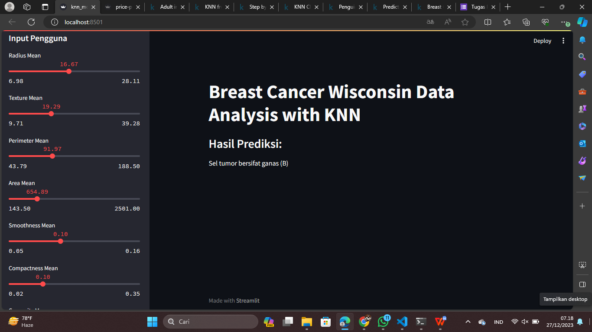